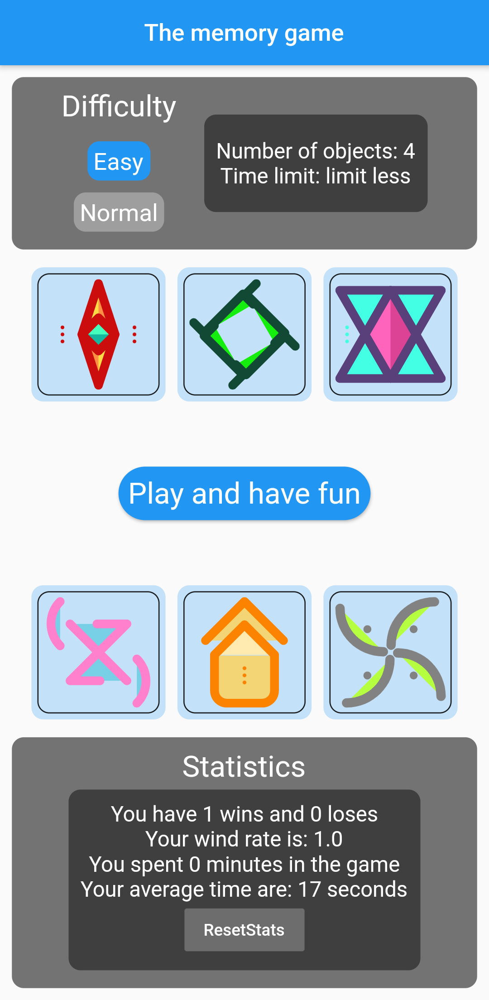
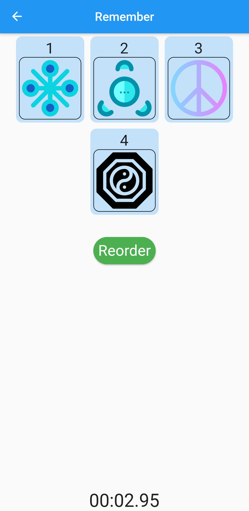
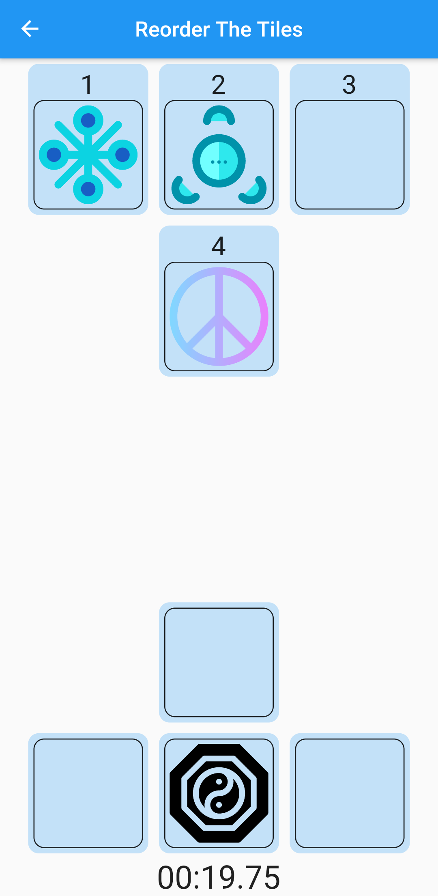
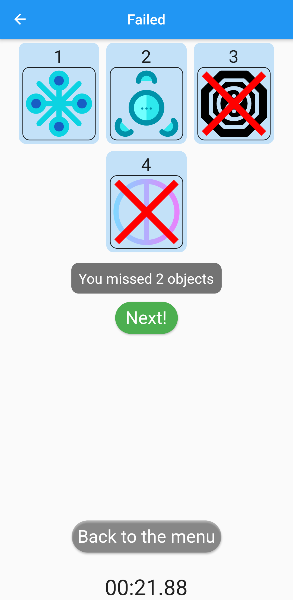

# Pendroid 2020 Part 1 - Memory Game

## Project Description

This project is a simple memory game, written in Flutter, created for the Pendroid 2020 competition. The game features a minimum of 4 objects.

| | | | |
|:--:|:--:|:--:|:--:|
|  |  |  |  |

## Game Mechanics

The game introduces a unique mechanism to first display the order of the objects. The goal of the game is then to replicate the previously shown pattern by imitating the sequence of the objects.

## License

This project is licensed under the MIT License - see the [LICENSE](LICENSE) file for details